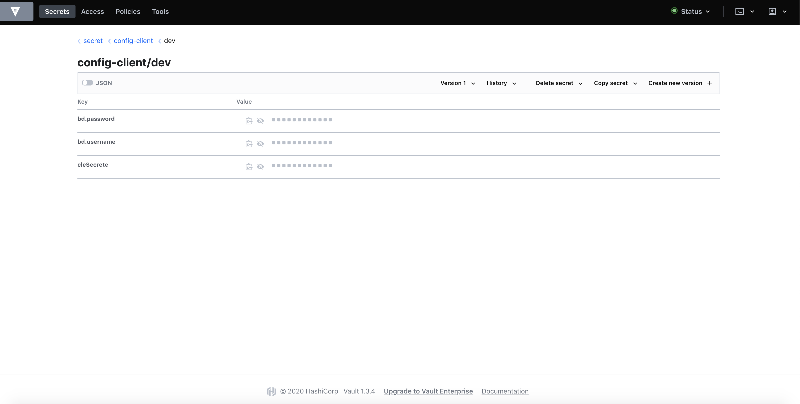
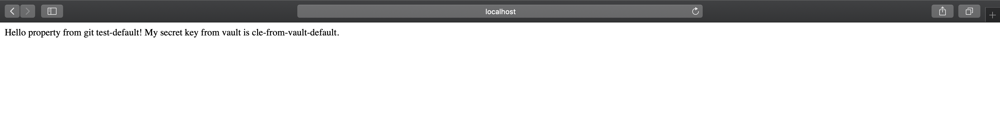

# Spring Cloud Config With Vault

### Prerequisites 

- Java
- Maven
- Docker 

### Vault with docker

Open up a terminal

1. $`docker run -d -p 8200:8200 --name vault-with-git-test -e 'VAULT_DEV_ROOT_TOKEN_ID=my-root-token-id' -e 'VAULT_DEV_LISTEN_ADDRESS=0.0.0.0:8200' vault` 

- View Vault [url](http://localhost:8200) (method : token, token : my-root-token-id)

1. $`docker exec -i -t vault-with-git-test sh`
1. $`export VAULT_ADDR='http://localhost:8200'`
1. $`vault login token=my-root-token-id'`
1. $`vault kv put secret/config-client bd.username=dbUser-from-vault-default cleSecrete=cle-from-vault-default bd.password=mot-de-passe-from-vault-default`
1. $`vault kv put secret/config-client/dev bd.username=dbUser-from-vault-dev cleSecrete=cle-from-vault-dev bd.password=mot-de-passe-from-vault-dev`
1. Result

### Start config server

Open up a terminal within the root of the project

1. $`cd config-server` 
1. $`mvn clean install`
1. $`mvn spring-boot:run`

### Start config client (default profile)

Open up a terminal within the root of the project

1. $`cd config-client` 
1. $`mvn clean install`
1. $`mvn spring-boot:run`

- View Vault [url](http://localhost:8080) (default profile)

1. $`mvn spring-boot:run -Dspring.profiles.active=dev`

- View Vault [url](http://localhost:8080) (dev profile)

